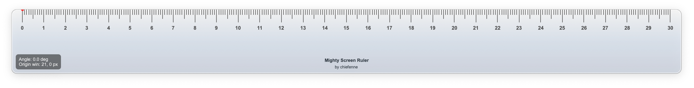
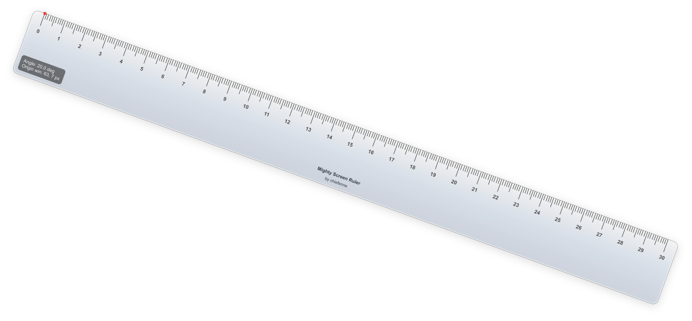
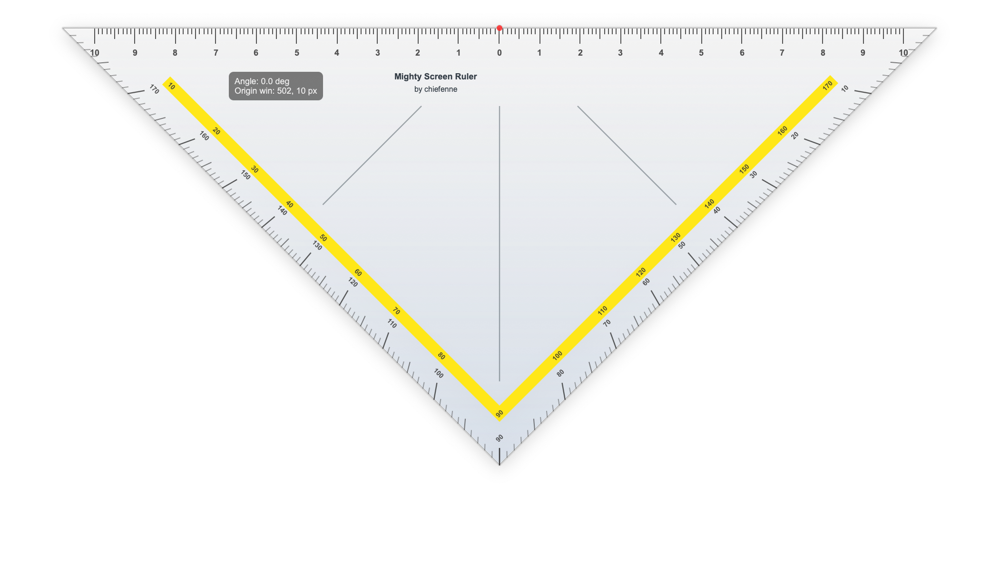
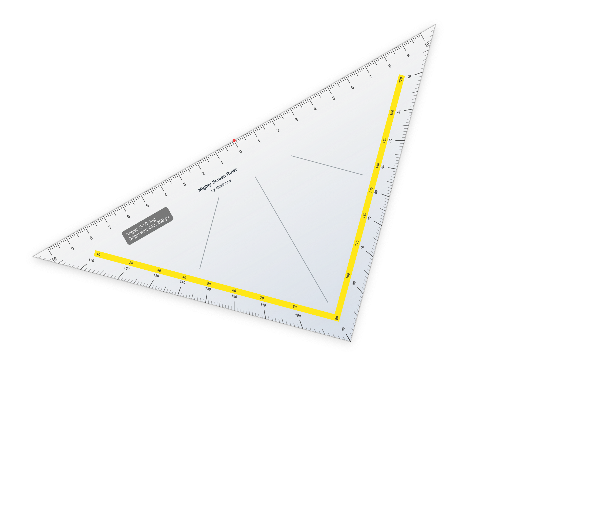

# Mighty Screen Ruler

Mighty Screen Ruler is a transparent on-screen ruler which stays on top of other windows. It provides a rectangular ruler and a triangular drafting ruler with metric and imperial scales, keyboard control, pivot-based rotation, configurable sizing, and angle annotations.

## Screenshots

<p align="center">
  
  <br>
  <em>Figure 1: Rectangular ruler in default orientation</em>
</p>

<p align="center">
  
  <br>
  <em>Figure 2: Rectangular ruler rotated 20° about its pivot point</em>
</p>

<p align="center">
  
  <br>
  <em>Figure 3: Triangular ruler in default orientation</em>
</p>

<p align="center">
  
  <br>
  <em>Figure 4: Triangular ruler rotated -30° about its pivot point</em>
</p>

## Features

- Always-on-top ruler
- Rectangular and triangular ruler modes
- Metric and imperial units
- Pivot-based rotation with fine and fast keyboard increments
- Keyboard resizing with configurable increments
- Window-position and current-angle annotation
- Highly configurable through a JSON config file
- Triangle edge angle scales with optional secondary inner scale
- Triangle origin guide lines

## Releases

The `release/` folder is the deployment folder. Each OS folder should contain one ZIP file.

### macOS

Use:

`release/macos/Mighty_Screen_Ruler-macos-x86_64.zip`

Unzip it and open `Mighty_Screen_Ruler.app`.

The macOS app is unsigned. If macOS says Apple cannot verify the app, use one of these workarounds after unzipping:

1. Open `System Settings` -> `Privacy & Security`, then choose `Open Anyway` for `Mighty_Screen_Ruler.app`. You may need to try opening the app once or twice before the button appears.
2. Or remove the download quarantine flag in Terminal:

```bash
xattr -dr com.apple.quarantine /path/to/Mighty_Screen_Ruler.app
open /path/to/Mighty_Screen_Ruler.app
```

### Windows

Not available yet. Planned release file:

`release/windows/Mighty_Screen_Ruler-windows-x86_64.zip`

### Linux

Not available yet. Planned release file:

`release/linux/Mighty_Screen_Ruler-linux-x86_64.zip`

## Run From Source

Requirements:

- Python 3.12 or newer
- PySide6-Essentials

`requirements.txt` also includes Nuitka for building release ZIPs.

From the repository root:

```bash
python3 -m pip install -r requirements.txt
python3 Mighty_Screen_Ruler.py
```

Press `H` in the app to open the help popup.

## Configuration

Most behavior can be adjusted in the per-user `ruler_config.json`, stored at:

- macOS: `~/Library/Preferences/Mighty_Screen_Ruler/ruler_config.json`
- Windows: `%APPDATA%\Mighty_Screen_Ruler\ruler_config.json`
- Linux: `${XDG_CONFIG_HOME:-~/.config}/Mighty_Screen_Ruler/ruler_config.json`

Configurable behavior includes:

- default units
- size increments
- angle increments
- ruler dimensions
- branding text and color
- triangle angle scales
- triangle origin guide lines
- keyboard bindings

An example config is available at `examples/ruler_config.example.json`.

## License

MIT License. See `LICENSE`.
